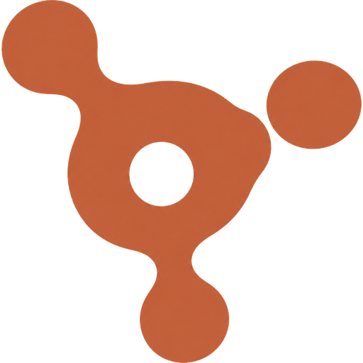

<div align="center">



# Oracle

**One window for every project you run.**

Local dev servers, VPS deployments, repositories and one-off scripts — launched, watched and
opened from a single place, without a terminal per project.

[](https://github.com/Alicienn/oracle/releases/latest)
[](https://github.com/Alicienn/oracle/releases)
[](https://github.com/Alicienn/oracle/releases/latest)
[](https://tauri.app)

</div>

---

## Install

Download the installer from the [latest release](https://github.com/Alicienn/oracle/releases/latest)
and run it:

**[Oracle_x64-setup.exe](https://github.com/Alicienn/oracle/releases/latest)** · about 2.6 MB

It installs for the current user, so it needs no administrator rights, and it keeps itself up
to date from then on — an available update appears as a line in the title bar, never as a
dialog over what you were doing.

---

## What it does

### Runs your projects

Each project is a folder, a command and, usually, a port. Press start and Oracle spawns it
through the system shell — so `npm run dev`, `cargo run` and
`npx prisma migrate && npm run dev` all work as written — then watches it.

The port is settled **before** anything is spawned. Two projects can never start on the same
one: Oracle names what is holding it, offers the next free port, and passes that port to the
command for that run only, leaving the project's own settings alone.

A project is reported as running once its port answers, not merely because a process exists.
Stopping takes down the whole process tree, because `cmd /C npm run dev` is three processes
deep before the dev server appears.

### Opens them without leaving

Starting a project that serves a page shows it booting in the central panel, waits a beat
past the moment its port answers — a server that is listening is usually still compiling —
and then reveals the page, inside Oracle. The project rail and the title bar stay where they
are, so you are never lost in a browser.

Leaving a web app keeps it alive off screen: coming back does not reload the page or lose
what was typed into it. The strip above it says what that costs in memory, and closing the
view gives it back.

### Shows what they cost

CPU and resident memory for each project, sampled once a second across its entire process
tree rather than the one PID Oracle spawned. A sparkline on every card carries the last
minute, and the tray panel shows the machine as a whole.

### Watches what is deployed elsewhere

A project can be nothing but a URL. Oracle polls it on an interval and reports up, degraded
or down with a latency, and draws it with the icon its site serves — downloaded once and kept,
so it renders instantly and survives the site being offline.

### Reads the repository

Branch, upstream, ahead and behind counts, how many files are dirty, and the last commit.
Absent gracefully when `git` is not on the `PATH`.

### Stays out of the way

A tray icon with a real floating panel — search, gauges, start and stop — not a context menu,
reachable from anywhere with `Ctrl+Shift+Space`. Closing the window keeps Oracle running.
It can start with Windows, hidden, and bring your flagged projects up with it.

### Keeps itself current

Oracle reads its own release feed at launch. An update downloads in place, with a ring that
fills and then becomes a tick; installing is a separate, explicit step that stops your running
projects first, so nothing is left orphaned holding a port. After an update it offers the
changelog for the version you are now running.

---

## Requirements

Windows 10 or 11, x64. The WebView2 runtime is already present on Windows 11 and on any
up-to-date Windows 10; the installer fetches it if it is missing.

---

## Development

```bash
npm install
npm run tauri dev
```

The backend is Rust, the frontend is TypeScript with no framework and no runtime
dependencies — `h()` is the whole abstraction. `Ctrl+Shift+I` opens the interface's own
developer tools, in any build.

```bash
npm run build      # type-check and bundle the frontend
npm run tauri build # produce the installer
cargo test         # from src-tauri
```

---

## Releases and updating

Cutting a release is one command:

```bash
npm run release                        # or: npm run release -- --dry-run
```

It builds, signs, writes the manifest the updater reads, tags the commit, and publishes the
release with `gh`.

It refuses to publish a version with no `## <version>` section in
[CHANGELOG.md](CHANGELOG.md), and that section becomes the release notes — written once, so
the notes on GitHub and the ones Oracle shows after updating cannot drift apart.

Signing is not optional: the updater refuses any package it cannot verify against the public
key in `src-tauri/tauri.conf.json`, which is what makes an application that downloads and
runs an installer on its own acceptable. The private half of that keypair lives outside the
repository, is handed to the build as a path so its contents never reach a shell history, and
is never committed. Set `ORACLE_SIGNING_KEY` to use another location. Losing it means no
existing installation can ever be updated again, so keep a copy somewhere safe.

Nothing about this requires a secret on GitHub, and nothing is asked of users: the public key
ships inside the application. [The workflow](.github/workflows/release.yml) does the same job
on a runner for the day that is wanted instead, and is manual-only so it cannot race the local
path; it is the only route that needs the key uploaded as a repository secret.

---

## Documentation

- [Specification](docs/SPEC.md) — what the application is, and the decisions behind it
- [Implementation plan](docs/TODO.md) — the epics, and where each one stands
- [Changelog](CHANGELOG.md) — every released version
